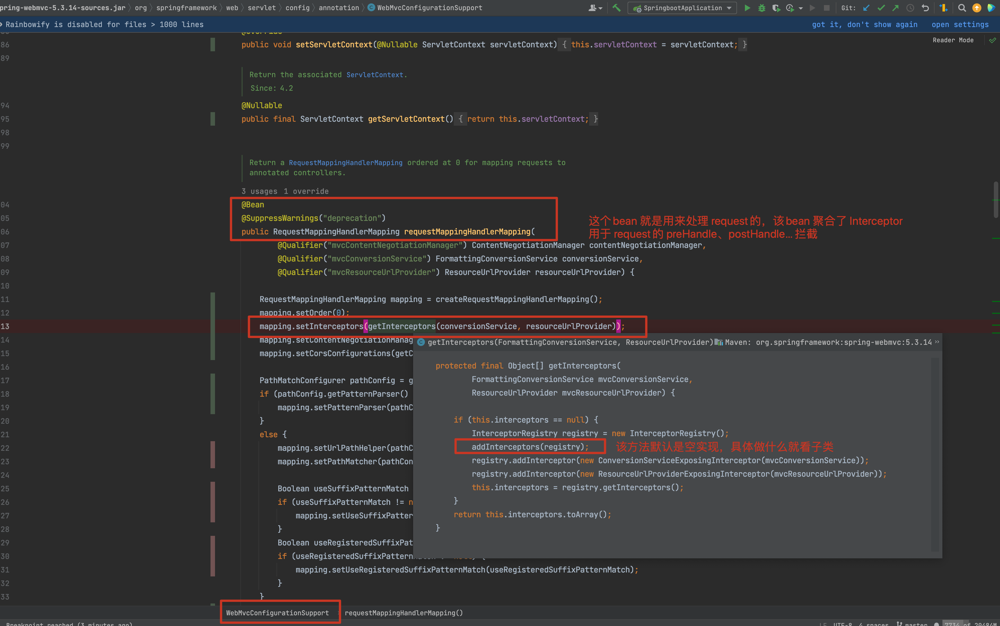
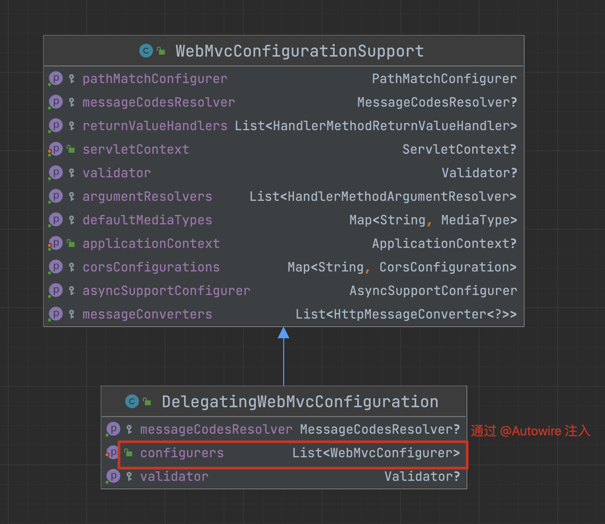
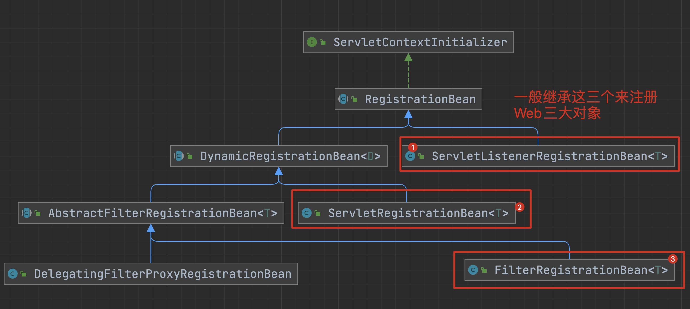

# 资料

[SpringBoot官方文档](https://docs.spring.io/spring-boot/docs/2.7.8/reference/html/)

[示例代码](../source-note-springboot)

# SpringBoot 是什么？

```java
/**
 * SpringBoot 是什么？
 * 1. SpringBoot 就是一个 创建、配置、刷新IOC容器 的工厂，最终的目的就是得到一个IOC容器
 * 2. 预留了很多接口，用于配置IOC容器，或者在容器的某个生命周期被回调，从而实现很多功能，比如 自动读取属性文件。
 *      特殊的接口：
 *          - BootstrapRegistryInitializer：用来初始化 DefaultBootstrapContext
 *          - SpringApplicationRunListener ：这是功能最多的接口，可用于 配置 Environment、配置IOC容器、接收IOC容器refresh结束回调，接收SpringBoot启动完成回调
 *          - ApplicationContextFactory：生成 Environment、ApplicationContext
 *          - ApplicationContextInitializer：初始化IOC容器
 *          - ApplicationRunner、CommandLineRunner：在IOC容器refresh完成后会回调该接口的方法
 *
 * 3. SpringBoot的自动配置，其实就是@Import一个类，这个类的逻辑就是读取配置文件得到自动注入的类有哪些，然后导入到IOC容器中
 * */
```

# 使用`@SpringBootApplication`会发生什么

```java
// 就是一个 @Configuration
@SpringBootConfiguration
// 会 @Import 导入类
@EnableAutoConfiguration
/**
 * TypeExcludeFilter 是一个大管家，我们可以往容器中注册 TypeExcludeFilter 类型的bean，扩展排除规则
 *
 * AutoConfigurationExcludeFilter 是用来排除
 * 		标注了 @AutoConfiguration 配置类
 * 			或者
 * 		META-INF/spring.factories key为 `EnableAutoConfiguration.class.getName()` 的类
 * 			或者
 *		META-INF/spring/`AutoConfiguration.class.getName()`.imports 文件中记录的类
 *
 * 注：因为这些类会被 @EnableAutoConfiguration 所解析
 * */
@ComponentScan(excludeFilters = { @Filter(type = FilterType.CUSTOM, classes = TypeExcludeFilter.class),
		@Filter(type = FilterType.CUSTOM, classes = AutoConfigurationExcludeFilter.class) })
public @interface SpringBootApplication {}
```

> spring-boot.jar!/META-INF/spring.factories
>
> spring-boot-autoconfigure.jar!/META-INF/spring/org.springframework.boot.autoconfigure.AutoConfiguration.imports
>
> 注：现在SpringBoot已经改了，建议将自动注入类写在 `imports` 文件中。

```java
// 这个只是注册 BasePackages.class 到容器中，没啥用
@AutoConfigurationPackage
/**
 * 会读取这两个文件拿到 自动注入的类 是啥：
 *  - 读取 META-INF/spring.factories 文件 key是 `AutoConfiguration.class.getName()`
 *  - 读取 META-INF/spring/`AutoConfiguration.class.getName()`.imports 文件的内容
 * */
@Import(AutoConfigurationImportSelector.class)
public @interface EnableAutoConfiguration {
   String ENABLED_OVERRIDE_PROPERTY = "spring.boot.enableautoconfiguration";
   Class<?>[] exclude() default {};
   String[] excludeName() default {};
}
```

# SpringBoot 生命周期

```java
/**
 * SpringBoot 生命周期
 *
 *  ConfigurableApplicationContext context = SpringApplication.run(Main.class, args);
 *  {@link SpringApplication#run(String...)}
 *
 *  1. 实例化一个 DefaultBootstrapContext
 *  bootstrapContext 的声明周期范围是 IOC容器refresh之前
 *      DefaultBootstrapContext bootstrapContext = createBootstrapContext();
 *
 *      Tips：会回调 BootstrapRegistryInitializer#initialize 对其初始化
 *
 *  2. 构造出 SpringApplicationRunListeners ，它是 SpringApplicationRunListener 的注册器
 *      SpringApplicationRunListeners listeners = getRunListeners(args);
 *
 *  3. 回调 SpringApplicationRunListener#starting 方法，可以在这个方法装饰 bootstrapContext
 *      listeners.starting(bootstrapContext, this.mainApplicationClass);
 *
 *      Tips：其实就是回调 listeners 中注册的 SpringApplicationRunListener 方法
 *
 *  4. 将方法参数装饰一下
 *      ApplicationArguments applicationArguments = new DefaultApplicationArguments(args);
 *
 *  5. 构造出 ConfigurableEnvironment
 *      ConfigurableEnvironment environment = prepareEnvironment(listeners, bootstrapContext, applicationArguments);
 *
 *      Tips：
 *          1. 可以使用 ApplicationContextFactory 来生成 ConfigurableEnvironment
 *          2. 回调 SpringApplicationRunListener#environmentPrepared 配置 ConfigurableEnvironment
 *              Tips：application.yml 或者 SpringCloud 的 bootstrap.yml 就是通过这里的回调实现的
 *
 *          3. 修改属性的访问顺序为： 命令行参数 -> 系统属性 -> 环境变量 ... -> 默认属性(默认是空的)
 *
 *  6. 构造出 Banner 并打印出banner的内容
 *      Banner printedBanner = printBanner(environment);
 *
 *      Tips：
 *          会尝试从 environment 获取属性指定的文件：spring.banner.image.location、spring.banner.location
 *          或者是 banner.[jpg | gif | png | txt]对应的文件
 *          作为要输出的内容
 *
 *  7. 会根据classpath是否有某些类 推断出应该创建什么类型的IOC容器
 *      ConfigurableApplicationContext context = createApplicationContext();
 *
 *  8. 配置 IOC 容器
 *      prepareContext(bootstrapContext, context, environment, listeners, applicationArguments, printedBanner);
 *
 *      Tips：
 *          1. 给IOC容器设置上 environment
 *          2. 给IOC容器设置上 ResourceLoader、ConversionService
 *          3. 回调 ApplicationContextInitializer、SpringApplicationRunListener、bootstrapContext 方法
 *              3.1 初始化IOC容器    ApplicationContextInitializer#initialize
 *              3.2 配置IOC容器     SpringApplicationRunListener#contextPrepared
 *              3.3 完成DefaultBootstrapContext的生命周期      DefaultBootstrapContext#close
 *              3.4 IOC容器配置好了   SpringApplicationRunListener#contextLoaded
 *                  Tips：将 listeners 中的 ApplicationListener 扩展给 context
 *
 *          4. 添加单例bean：springApplicationArguments、springBootBanner
 *          5. 设置两个属性 allowCircularReferences、allowBeanDefinitionOverriding
 *          6. 添加两个BeanFactoryPostProcessor：
 *                  LazyInitializationBeanFactoryPostProcessor：这个是用来判断是否需要给补全信息的 `beanDefinition.setLazyInit(true);`
 *                  PropertySourceOrderingBeanFactoryPostProcessor：这个是用来将名叫 defaultProperties 的 PropertySource 移到 最后面的，也就是属性访问的优先级最低
 *          7. 将启动类添加到IOC容器中，说白了就是注册配置类
 *
 *  9. 刷新IOC容器
 *      refreshContext(context); // 其实就是执行 applicationContext.refresh();
 *      afterRefresh(context, applicationArguments); // 预留的模板方法，空实现
 *
 *  10. 回调 SpringApplicationRunListener#started 方法
 *      listeners.started(context, timeTakenToStartup);
 *
 *      Tips：会回调 {@link ApplicationContextFactory#create(WebApplicationType)} 方法构造出 context
 *
 *  11. 回调 容器中类型是 ApplicationRunner、CommandLineRunner 的bean的方法
 *      callRunners(context, applicationArguments);
 *
 *      Tips：
 *          ApplicationRunner 优先于 CommandLineRunner 执行，然后同种类型会按照 Ordered 或者 @Order 或者 @Priority 升序排序 ，值越小越先执行
 *
 *  12. 回调 SpringApplicationRunListener#ready 方法（SpringBoot启动耗时）
 *      listeners.ready(context, timeTakenToReady);
 *
 *  13. 返回IOC容器
 *      return context;
 *
 * Tips：BootstrapRegistryInitializer、SpringApplicationRunListener、ApplicationContextFactory
 *      按照 类全名作为key 读取 META-INF/spring.factories 得到的
 * */
```


# @EnableConfigurationProperties

```java
/**
 * 属性绑定
 *
 * 使用 @EnableConfigurationProperties 会发生什么？
 *
 * 1. 会导入 @Import(EnableConfigurationPropertiesRegistrar.class)
 *
 * 2. EnableConfigurationPropertiesRegistrar 的回调方法的逻辑
 *      2.1 会注册这几个bean
 *          ConfigurationPropertiesBindingPostProcessor
 *          ConfigurationPropertiesBinder.Factory
 *          ConfigurationPropertiesBinder
 *          BoundConfigurationProperties
 *
 *      2.2 会拿到 @EnableConfigurationProperties(value = {A.class}) 的注解值，构造出 BeanDefinition 然后注册到 BeanFactory 中
 *          注：A 必须标注 @ConfigurationProperties 否则会检验失败，直接报错
 *
 * Tips：spring-boot-autoconfigure.jar 的 META-INF/spring/org.springframework.boot.autoconfigure.AutoConfiguration.imports
 *      写了 ConfigurationPropertiesAutoConfiguration，也就是默认情况下属性注入的功能是开启的
 *       @AutoConfiguration
 *       @EnableConfigurationProperties
 *       public class ConfigurationPropertiesAutoConfiguration {}
 *
 *
 * ConfigurationPropertiesBindingPostProcessor 会在bean初始化化前阶段生效
 * {@link ConfigurationPropertiesBindingPostProcessor#postProcessBeforeInitialization(Object, String)}
 *      拦截有 @ConfigurationProperties 的bean 对其进行属性注入(得有set方法才行)
 * */
```

# 属性文件的加载顺序

> 代码太狠了，只能看懂整体流程，没有细琢磨，反正能实现自定义扩展就挺好的。

```java
/**
 * {@link SpringApplication#run(String...)}
 * {@link SpringApplication#prepareEnvironment(SpringApplicationRunListeners, DefaultBootstrapContext, ApplicationArguments)}
 * {@link EventPublishingRunListener#environmentPrepared(ConfigurableBootstrapContext, ConfigurableEnvironment)}
 * {@link EnvironmentPostProcessorApplicationListener#onApplicationEvent(ApplicationEvent)}
 * {@link EnvironmentPostProcessorApplicationListener#onApplicationEnvironmentPreparedEvent(ApplicationEnvironmentPreparedEvent)}
 *      读取 META-INF/spring.factories 文件 key 为 EnvironmentPostProcessor 的值，实例化然后回调方法
 *      {@link EnvironmentPostProcessor#postProcessEnvironment(ConfigurableEnvironment, SpringApplication)}
 *      {@link ConfigDataEnvironmentPostProcessor#postProcessEnvironment(ConfigurableEnvironment, SpringApplication)}
 *      {@link ConfigDataEnvironment#processAndApply()}
 *          1. 读取这三个属性值，作为要查找的属性文件
 *              spring.config.import
 *              spring.config.additional-location
 *              spring.config.location
 *                  这个存在默认值：classpath:/;classpath:/config/;file:./;file:./config/;file:./config/`*`/
 *                  就是因为是这个默认值，所以SpringBoot项目可以在 项目路径下写 application.yml 就能生效
 *
 *          2. 如果写的是路径 默认会拼接上 application.[yaml|yml|properties|xml] 读取属性文件成为 PropertySource
 *               注：application 是默认值，可以设置属性 spring.config.name 修改这个值
 *
 *          3. 拿到 spring.profiles.include(多个值会合并) 和 spring.profiles.active(按照优先级只会取第一个) 的值作为的 profile 的值
 *
 *          4. 遍历第二步的值 拼接上 profile 作为文件名，读取文件成为 PropertySource
 *
 *          5. 将 第二步和第四步的 PropertySource 扩展到 IOC容器的 Environment 中
 *
 * */
```

```java
/**
 *
 * application.yml 的解析主要涉及到这几个类。可以 META-INF/spring.factories 中设置的key的值，从而实现扩展属性文件的读取
 *
 * org.springframework.boot.context.config.ConfigDataLocationResolver
 *  举例: StandardConfigDataLocationResolver
 *  解析的是路径，那就拼接上 application 作为文件名。解析的是文件那就不需要做处理
 *  文件允许啥扩展名和怎么解析是依赖于 PropertySourceLoader
 *  注：application 是默认值，可以设置属性 spring.config.name 修改这个值
 *
 * org.springframework.boot.env.PropertySourceLoader
 *  这是用来判断支持那些文件扩展名 和 解析属性文件成 PropertiesSource
 *
 * org.springframework.boot.context.config.ConfigDataLoader
 *  是用来处理 ConfigDataLocationResolver 的解析结果
 *
 * */
```

## 示例代码

```java
public class Main {

    public static void main(String[] args) throws Exception {
        // System.setProperty("spring.profiles.active", "dev");
        System.setProperty("spring.profiles.include", "ext1,ext2");

        // 这种方式增加的属性文件是一定生效的
        System.setProperty("spring.config.import", "classpath:/config/1.properties");
        System.setProperty("spring.config.additional-location", "classpath:/ext/application-haitao.yml");
        System.setProperty("spring.config.location", String.join(",",
                        Arrays.asList(
                                "optional:classpath:/;optional:classpath:/config/",
                                "optional:file:./;optional:file:./config/;optional:file:./config/*/"
                                /*,"optional:classpath:/haitao.properties"*/) // 注：使用 "optional:" 表示允许文件不存在
                )
        );
        /**
         * 不能统配多个文件，只能统配到某个目录
         * System.setProperty("spring.config.additional-location", "classpath:/ext/`*`.yml"); // 不支持
         * System.setProperty("spring.config.additional-location", "classpath:/`*`/ext/");  // 支持，会找这个目录下名叫 application 的文件
         * */
        ConfigurableApplicationContext context = SpringApplication.run(cn.haitaoss.Main.class, new String[]{"haitao"});

        ConfigurableEnvironment environment = context.getEnvironment();
        System.out.println(environment.getProperty("dev"));
        System.out.println(environment.getProperty("bootstrap"));

    }
}
```

# 自动装配举例

## Tomcat 自动装配原理

看这个

```shell
# SpringBoot 启动的时候会读取这个文件，缓存 Key-Value 对
spring-boot-autoconfigure-2.6.2.jar!/META-INF/spring.factories

# 主要是配置了这个value
org.springframework.boot.autoconfigure.web.servlet.ServletWebServerFactoryAutoConfiguration
```

`ServletWebServerFactoryAutoConfiguration` 会导入 `BeanPostProcessor` 

```java
@Configuration(proxyBeanMethods = false)
@AutoConfigureOrder(Ordered.HIGHEST_PRECEDENCE)
@ConditionalOnClass(ServletRequest.class)
@ConditionalOnWebApplication(type = Type.SERVLET)
@EnableConfigurationProperties(ServerProperties.class)
@Import({ ServletWebServerFactoryAutoConfiguration.BeanPostProcessorsRegistrar.class, // 这个是关键，注册一个 BeanPostProcessor 
		ServletWebServerFactoryConfiguration.EmbeddedTomcat.class, // 这些是不同的 内嵌web容器
		ServletWebServerFactoryConfiguration.EmbeddedJetty.class,
		ServletWebServerFactoryConfiguration.EmbeddedUndertow.class })
public class ServletWebServerFactoryAutoConfiguration {

	@Bean // 这个bean 也是挺有用的
	public ServletWebServerFactoryCustomizer servletWebServerFactoryCustomizer(ServerProperties serverProperties,
			ObjectProvider<WebListenerRegistrar> webListenerRegistrars,
			ObjectProvider<CookieSameSiteSupplier> cookieSameSiteSuppliers) {
		return new ServletWebServerFactoryCustomizer(serverProperties,
				webListenerRegistrars.orderedStream().collect(Collectors.toList()),
				cookieSameSiteSuppliers.orderedStream().collect(Collectors.toList()));
	}

  // 默认注入这个 WebServerFactoryCustomizer 类型的bean，后置处理器会获取这个bean 来将配置文件配置的属性 设置到 内嵌web容器中 
	@Bean
	@ConditionalOnClass(name = "org.apache.catalina.startup.Tomcat")
	public TomcatServletWebServerFactoryCustomizer tomcatServletWebServerFactoryCustomizer(
			ServerProperties serverProperties) {
		return new TomcatServletWebServerFactoryCustomizer(serverProperties);
	}
}
```

导入的 `WebServerFactoryCustomizerBeanPostProcessor`

```java
public class WebServerFactoryCustomizerBeanPostProcessor implements BeanPostProcessor, BeanFactoryAware {


	@Override
	public Object postProcessBeforeInitialization(Object bean, String beanName) throws BeansException {
		if (bean instanceof WebServerFactory) {
      // 只处理 WebServerFactory 类型。其实就是将我们配置的属性 设置到这个对象中
			postProcessBeforeInitialization((WebServerFactory) bean);
		}
		return bean;
	}

	@SuppressWarnings("unchecked")
	private void postProcessBeforeInitialization(WebServerFactory webServerFactory) {
    
    // getCustomizers() ---> 其实就是从容器中获取 WebServerFactoryCustomizer 类型的bean，这个bean是在自动装配的时候默认会注入的
		LambdaSafe.callbacks(WebServerFactoryCustomizer.class, getCustomizers(), webServerFactory)
				.withLogger(WebServerFactoryCustomizerBeanPostProcessor.class)
				.invoke((customizer) -> customizer.customize(webServerFactory));
	}
  
}
```

## SpringMVC 自动装配

### spring-boot-starter-web 自动注入了什么

1. 在 SpringBoot 项目引入 `spring-boot-starter-web`

```xml
<dependency>
  <groupId>org.springframework.boot</groupId>
  <artifactId>spring-boot-starter-web</artifactId>
</dependency>
```

2. 最终会引入 `spring-boot-autoconfigure.jar`

3. `spring-boot-autoconfigure` 里面的 `META-INF/spring/org.springframework.boot.autoconfigure.AutoConfiguration.imports` 文件是自动配置的关键

   注：老版本是读的 `/META-INF/spring.factories`

4. 配置类说明

   > DispatcherServletAutoConfiguration：
   >
   > - 这个就是 SpringMVC 咯
   >
   > WebMvcAutoConfiguration：
   >
   > - 这个就是配置SpringMVC 的一些组件：HandlerInterceptor、ViewResolver等等
   >
   > - 里面主要是自动注入了默认bean，而且包含了 `@EnableWebMvc` 注入的bean在里面
   >
   > - 所以我感觉  `@EnableWebMvc` 和 自定义 `WebMvcConfigurationSupport` 子类注入到容器中 属实有点多余

```java
@Configuration(proxyBeanMethods = false)
@ConditionalOnWebApplication(type = Type.SERVLET)
@ConditionalOnClass({ Servlet.class, DispatcherServlet.class, WebMvcConfigurer.class })
@ConditionalOnMissingBean(WebMvcConfigurationSupport.class) // look at
@AutoConfigureOrder(Ordered.HIGHEST_PRECEDENCE + 10)
@AutoConfigureAfter({ DispatcherServletAutoConfiguration.class, TaskExecutionAutoConfiguration.class,
		ValidationAutoConfiguration.class })
public class WebMvcAutoConfiguration {}
```

5. `@EnableWebMvc` 做了什么

   > 导入了 DelegatingWebMvcConfiguration ，这个其实就是 WebMvcConfigurationSupport 的子类，所以但我们使用 `@EnableWebMvc` 会让SpringBoot 默认的 SpringMVC 失效

```java
@Retention(RetentionPolicy.RUNTIME)
@Target(ElementType.TYPE)
@Documented
@Import(DelegatingWebMvcConfiguration.class)
public @interface EnableWebMvc {
}
```

6. DelegatingWebMvcConfiguration 

```java
// 继承 WebMvcConfigurationSupport 重写一些可配置的方法
// 关键bean是 WebMvcConfigurationSupport 这里面定义注入的
public class DelegatingWebMvcConfiguration extends WebMvcConfigurationSupport {}
```

> DelegatingWebMvcConfiguration： 会从容器中得到 `List<WebMvcConfigurer> configurers` 
>
> 比如加工 interceptor



### 破坏 SpringMVC 的自动装配

> 其实没必要破坏 SpringBoot 默认注入，因为默认注入就包含了下面的内容了。要想自定义也可以通过往容器中注入bean的方式，取消掉默认注入的bean

原理：SpringMVC 自动注入的类 `WebMvcAutoConfiguration` 注入条件是`@ConditionalOnMissingBean(WebMvcConfigurationSupport.class) `



第一种方式：

```java
@EnableWebMvc // 其实就是注入了 DelegatingWebMvcConfiguration
public class ConfigClass{}
```

```java
@Retention(RetentionPolicy.RUNTIME)
@Target(ElementType.TYPE)
@Documented
@Import(DelegatingWebMvcConfiguration.class)
public @interface EnableWebMvc {
}
```

第二种方式（别使用这种方式，局限太多了）：

```java
@Component
public class WebConfig extends WebMvcConfigurationSupport {}
```

第三种方式：

```java
@Component
public class WebConfig extends DelegatingWebMvcConfiguration {}
```

### 注册 HandlerInterceptor 的方式

#### 继承 WebMvcConfigurationSupport 的方式

> 缺点非常明显：不能动态的设置 addInterceptors
>
> 就是你往容器中添加
>
> ```java
> @Component
> class MyWebMvcConfigurer1 implements WebMvcConfigurer {
> 	  @Override
>  protected void addInterceptors(InterceptorRegistry registry) {
>      registry.addInterceptor(new MyHandlerInterceptor())
>              .addPathPatterns("/**");
>  }
> }
> ```
>
> 是无法添加成功的

```java
@Component
class WebConfig extends WebMvcConfigurationSupport {
    @Override
    protected void addInterceptors(InterceptorRegistry registry) {
        registry.addInterceptor(new MyHandlerInterceptor())
                .addPathPatterns("/**");
    }
}
```

要想在 `WebConfig` 的基础上又增加 `addInterceptors`。只能这样子，套娃处理

```java
@Component
class WebConfigSon extends WebConfig {
    @Override
    protected void addInterceptors(InterceptorRegistry registry) {
			// 注册父类的
     super.addInterceptors(registry);
      
     // 在注册新加的
     registry.addInterceptor(new MyHandlerInterceptor())
                .addPathPatterns("/**");
    }
}
```

**注意：要保证 `WebConfigSon` 先注册， `WebConfig` 后注册，才能生效。具体原因如下：**

> 首先，拦截器是通过注册`requestMappingHandlerMapping` 这个bean 实现的
>
> ```java
> // 这是伪代码
> public class WebMvcConfigurationSupport {
> 	@Bean
> 	public RequestMappingHandlerMapping requestMappingHandlerMapping() {
> 			// 执行方法，注册Interceptor
>  	addInterceptors(registry);
> }
> }
> ```
>
> 因为 WebConfigSon、WebConfig 都继承了WebMvcConfigurationSupport。而 WebMvcConfigurationSupport 里面有@Bean 标注的方法。
>
> 当 Spring 在解析配置类时，如果发现该配置类有父类，且父类中含有@Bean方法，会把父类作为配置类进行解析。为了保证父类只会被解析一次会通过缓存来记录，记录的信息会包含该子类配置类是谁。
>
> `org.springframework.context.annotation.ConfigurationClassParser#doProcessConfigurationClass(org.springframework.context.annotation.ConfigurationClass, org.springframework.context.annotation.ConfigurationClassParser.SourceClass, java.util.function.Predicate)`
>
> 所以 WebConfigSon、WebConfig  先加载的才会有 `requestMappingHandlerMapping` bean。
>
> 当执行`requestMappingHandlerMapping()` 方式创建bean时，此时的 `this` 就是`[WebConfigSon|WebConfig ]` 中的一个，要想保证`this 是WebConfigSon` 那么就需要 WebConfigSon 比 WebConfig先被加载 
>
> 如何确保第一个加载？
>
> 1. 修改启动类，多添加一个配置类
>
> ```java
> @SpringBootApplication
> public class SpringbootApplication implements CommandLineRunner {
> 
>     public static void main(String[] args) {
>         SpringApplication.run(new Class[]{SpringbootApplication.class, MyConfig3.class}, args);
>     }
> }
> ```
>
> 2. 编写 MyConfig3
>
> ```java
> @Configuration
> @Import(WebMvcConfigurationSupport2.class)
> @Order(-1) // 这个很关键，保证优先加载、注册这个配置的信息
> public class MyConfig3 {
>   // @Bean 注入方式，不会解析父类的方法中是否存在 @Bean 标注的方法
> }
> 
> class WebMvcConfigurationSupport2 extends WebMvcConfigurationSupport {
>     @Override
>     protected void addInterceptors(InterceptorRegistry registry) {
>       System.out.println("WebMvcConfigurationSupport2---->");
>       super.addInterceptors(registry);
>   }
> ```
>
> ```java
> // 方式二
> @ComponentScan
> @Order(-1)
> public class MyConfig3 {}
> 
> @Component
> class WebMvcConfigurationSupport2 extends WebMvcConfigurationSupport {
> 
>     @Override
>     protected void addInterceptors(InterceptorRegistry registry) {
>         System.out.println("WebMvcConfigurationSupport2---->");
>         super.addInterceptors(registry);
>     }
> }
> ```
>
> 

#### 默认注入、@EnableWebMvc 和 继承DelegatingWebMvcConfiguration 的方式

这三种方式本质上就是往容器中注入 `DelegatingWebMvcConfiguration` bean。`DelegatingWebMvcConfiguration` 核心源码分析：

```java
public class DelegatingWebMvcConfiguration extends WebMvcConfigurationSupport {

	private final WebMvcConfigurerComposite configurers = new WebMvcConfigurerComposite();


  // 关键点在这，会从容器中获取 WebMvcConfigurer
	@Autowired(required = false)
	public void setConfigurers(List<WebMvcConfigurer> configurers) {
		if (!CollectionUtils.isEmpty(configurers)) {
			this.configurers.addWebMvcConfigurers(configurers);
		}
	}
  
  // 设置默认属性时，会使用所有的 WebMvcConfigurer 进行加工
  @Override
	protected void addInterceptors(InterceptorRegistry registry) {
		this.configurers.addInterceptors(registry);
	}
}
```

方式一：直接往容器中注入 `WebMvcConfigurer` 实现类即可

```java
@Component
class MyWebMvcConfigurer1 implements WebMvcConfigurer {
    @Override
    public void addInterceptors(InterceptorRegistry registry) {
        registry.addInterceptor(new MyHandlerInterceptor())
                .addPathPatterns("/**");
    }
}
```

方式二：继承`DelegatingWebMvcConfiguration` 重写对应的方法

```java
@Component
public class WebConfigurer extends DelegatingWebMvcConfiguration {
  @Override
    protected void addInterceptors(InterceptorRegistry registry) {
        registry.addInterceptor(new MyHandlerInterceptor())
                .addPathPatterns("/**");
        registry.addInterceptor(new MyHandlerInterceptor())
                .addPathPatterns("/**");
      
      	// 这一步很关键，不执行会导致 方式一 失效。
        super.addInterceptors(registry);
    }
}
```

### 注册 Web 原生组件

#### 方式一：@ServletComponentScan 

> Servlet 3.0 提供了以下 3 个注解：
>
> - @WebServlet：用于声明一个 Servlet；
> - @WebFilter：用于声明一个 Filter；
> - @WebListener：用于声明一个 Listener。
>
> SrpingBoot 用于扫描 Serlvet 的注解:
>
> - `@ServletComponentScan` ，该注解可以扫描标记 @WebServlet、@WebFilter 和 @WebListener 三个注解的组件类，并将它们注册到容器中。

```java
@ServletComponentScan
@Component
public class WebConfig {}

@WebListener // MyListener 必须是public修饰的且有无参构造器
public class MyListener implements ServletContextListener {
    @Override
    public void contextInitialized(ServletContextEvent sce) {
        System.out.println("cn.haitaoss.springboot.config.MyListener.contextInitialized...");
    }
}

@WebFilter
class MyFilter implements Filter {
    @Override
    public void init(FilterConfig filterConfig) throws ServletException {
        System.out.println("cn.haitaoss.springboot.config.MyFilter.init...");
    }

    @Override
    public void doFilter(ServletRequest request, ServletResponse response, FilterChain chain) throws IOException, ServletException {
        System.out.println("cn.haitaoss.springboot.config.MyFilter.doFilter...");
        chain.doFilter(request, response);
    }
}

@WebServlet(urlPatterns = "/haitao")
class MyServlet extends HttpServlet {
    @Override
    protected void service(HttpServletRequest req, HttpServletResponse resp) throws ServletException, IOException {
        System.out.println("cn.haitaoss.springboot.config.MyServlet.service...");
    }
}
```

#### 方式二：使用 RegistrationBean 注册

> 使用 RegistrationBean 来注册原生 Web 组件
>
> RegistrationBean 是个抽象类，负责将组件注册到 Servlet 容器中，Spring 提供了三个它的实现类，分别用来注册 Servlet、Filter 和 Listener。
>
> - ServletRegistrationBean：Servlet 的注册类
> - FilterRegistrationBean：Filter 的注册类
> - ServletListenerRegistrationBean：Listener 的注册类
>
>
> 我们可以在配置类中，使用 @Bean 注解将 ServletRegistrationBean、FilterRegistrationBean 和 ServletListenerRegistrationBean 添加 Spring 容器中，并通过它们将我们自定义的 Servlet、Filter 和 Listener 组件注册到容器中使用。

```java
@Configuration
public class WebConfig1 {
    public WebConfig1() {
        System.out.println("WebConfig1--->");
    }

    /**
     * 注册 servlet
     * @return
     */
    @Bean
    public ServletRegistrationBean servletRegistrationBean() {
        MyServlet myServlet = new MyServlet();
        return new ServletRegistrationBean(myServlet, "/");
    }

    /**
     * 注册过滤器
     * @return
     */
    @Bean
    public FilterRegistrationBean filterRegistrationBean() {
        FilterRegistrationBean filterRegistrationBean = new FilterRegistrationBean(new MyFilter());
        //注册该过滤器需要过滤的 url
        // filterRegistrationBean.setUrlPatterns(Arrays.asList("/index"));
        return filterRegistrationBean;
    }

    /**
     * 注册监听器
     * @return
     */
    @Bean
    public ServletListenerRegistrationBean servletListenerRegistrationBean() {
        return new ServletListenerRegistrationBean(new MyListener());
    }
}

class MyListener implements ServletContextListener {
    @Override
    public void contextInitialized(ServletContextEvent sce) {
        System.out.println("MyListener 监听到 ServletContext 初始化");
    }

    @Override
    public void contextDestroyed(ServletContextEvent sce) {
        System.out.println("MyListener 监听到 ServletContext 销毁");
    }
}

class MyFilter implements Filter {
    @Override
    public void init(FilterConfig filterConfig) throws ServletException {
        System.out.println("cn.haitaoss.springboot.config.MyFilter.init...");
    }

    @Override
    public void doFilter(ServletRequest request, ServletResponse response, FilterChain chain) throws IOException, ServletException {
        System.out.println("cn.haitaoss.springboot.config.MyFilter.doFilter...");
        chain.doFilter(request, response);
        System.out.println("cn.haitaoss.springboot.config.MyFilter.doFilter...after");
    }
}

class MyServlet extends HttpServlet {
    @Override
    protected void service(HttpServletRequest req, HttpServletResponse resp) throws ServletException, IOException {
        System.out.println("cn.haitaoss.springboot.config.MyServlet.service...");
    }
}
```

### RegistrationBean 注册原理

> 很简单，web容器启动的时候会从IOC容器中获取 `ServletContextInitializer` 类型的bean，注册到web容器中
>
> ```java
> /** 
>          * web容器启动时会遍历执行，完成初始化操作 {@link org.springframework.boot.web.servlet.ServletContextInitializer#onStartup(javax.servlet.ServletContext)}
>          * 执行这子类重写的方法 {@link org.springframework.boot.web.servlet.RegistrationBean#onStartup(javax.servlet.ServletContext)}
>          * 执行子类重写的方法：
>          *      {@link org.springframework.boot.web.servlet.ServletListenerRegistrationBean#register(java.lang.String, javax.servlet.ServletContext)}
>          *      {@link org.springframework.boot.web.servlet.AbstractFilterRegistrationBean#addRegistration(java.lang.String, javax.servlet.ServletContext)}
>          *      {@link org.springframework.boot.web.servlet.ServletRegistrationBean#addRegistration(java.lang.String, javax.servlet.ServletContext)}
>          * 
>          * */
> ```
>
> 




### @ServletComponentScan 原理

```java
        /**
         * 1. 指定扫描包路径 @ServletComponentScan("package")
         * 2. 该注解会注册这个类型的bean {@link ServletComponentRegisteringPostProcessor}
         * 3. {@link ServletComponentRegisteringPostProcessor} 实现了 BeanFactoryPostProcessor，所以在 BeanFactory 初始化阶段，会回调方法
         * 4. 回调方法 {@link ServletComponentRegisteringPostProcessor#postProcessBeanFactory(ConfigurableListableBeanFactory)}
         * 5. 创建扫描器(指定includeFilter {@link ServletComponentRegisteringPostProcessor#createComponentProvider()} ),
         * 6. 开始扫描包 {@link ServletComponentRegisteringPostProcessor#scanPackage(ClassPathScanningCandidateComponentProvider, String)}
         * 7. 只会扫描标注了  @WebListener、@WebFilter、@WebServlet() 的类 {@link ClassPathScanningCandidateComponentProvider#findCandidateComponents(String)}
         * 8. 处理扫描到的类，封装成 ServletComponentWebListenerRegistrar、FilterRegistrationBean、ServletRegistrationBean 的 BeanDefinition 注册到IOC容器中
         *      遍历 ServletComponentHandler 处理(就是判断@WebListener、@WebFilter、@WebServlet()) {@link ServletComponentHandler#handle(AnnotatedBeanDefinition, BeanDefinitionRegistry)}
         *      使用对应的处理器进行处理。{@link ServletComponentHandler#doHandle(Map, AnnotatedBeanDefinition, BeanDefinitionRegistry)}
         *      处理的结果就是封装成对应的 RegistrationBean ，然后注册到 BeanDefinitionMap 中
         *
         *  注：
         *  1. @ServletComponentScan 只在嵌入式web应用才会生效，{@link ServletComponentRegisteringPostProcessor#isRunningInEmbeddedWebServer()}
         *  2. 对 @WebListener 的解析比较特殊
         *      - 解析方法 {@link WebListenerHandler#doHandle(Map, AnnotatedBeanDefinition, BeanDefinitionRegistry)}
         *      - 解析完注册的bean 是 {@link WebListenerHandler.ServletComponentWebListenerRegistrar}
         *      - 类型 {@link WebListenerRegistrar} 是在创建 {@link WebServerFactory} 的时候通过BeanPostProcessor {@link WebServerFactoryCustomizerBeanPostProcessor} 使用
         *          {@link WebServerFactoryCustomizer} 加工 WebServerFactory的，会把 @WebListener 的全类名注册到 AbstractServletWebServerFactory 的 webListenerClassNames 属性中
         *      - tomcat在启动的时候，是直接拿到全类名 反射调用实例方法创建的 @WebListener 标注的类。而 @WebFilter、@WebServlet() 是从IOC容器中获取的，
         *          所以 我们在使用嵌入式web应用的时候 是不支持 @WebListener 标注的类使用自动装配、bean后置处理器等功能的
         * */

```

### @WebListener  有点特殊

```java
/**
         *
         * @WebListener 解析过程，可以从两个角度看：
         *  1. 非嵌入式web容器如何解析的
         *      -> Servlet3.0 规范 本身就支持 @WebListener、@WebFilter、@WebServlet 来注册组件，注册逻辑很简单 反射调用无参构造器
         *  2. 嵌入web容器如何解析的???
         *
         *  注：@ServletComponentScan，如果是非嵌入式web容器，这个注解是不会生效的。
         *      具体判断逻辑在这里：{@link ServletComponentRegisteringPostProcessor#postProcessBeanFactory(ConfigurableListableBeanFactory)}
         *
         * 通过 @ServletComponentScan 这种方式解析 @WebListener 也是直接通过反射创建的，所以不能进行属性注入等操作。
         *      但是 解析 @WebFilter、@WebServlet 实例化bean是通过IOC容器创建的支持属性注入
         * {@link org.springframework.boot.web.servlet.WebListenerHandler#doHandle(java.util.Map, org.springframework.beans.factory.annotation.AnnotatedBeanDefinition, org.springframework.beans.factory.support.BeanDefinitionRegistry)}
         * 该方法会注册这个类型的bean {@link WebListenerHandler.ServletComponentWebListenerRegistrar}
         *
         * 而 这个是通过 beanPostProcessor 回调方法 实现的
         * {@link ServletWebServerFactoryAutoConfiguration}
         *  有@Bean 注册 {@link ServletWebServerFactoryAutoConfiguration#servletWebServerFactoryCustomizer(ServerProperties, ObjectProvider, ObjectProvider)}
         *
         *  有@Import 导入一个 BeanPostProcessorsRegistrar {@link ServletWebServerFactoryAutoConfiguration.BeanPostProcessorsRegistrar}
         *      这个会注册 BeanPostProcessor {@link WebServerFactoryCustomizerBeanPostProcessor}
         *      这个 BeanPostProcessor 会回调IOC容器中类型 WebServerFactoryCustomizer 的bean
         *
         * 也就是会调用这个
         * {@link ServletWebServerFactoryCustomizer#customize(ConfigurableServletWebServerFactory)}
         *  这里会 添加 listenerClassName 到 ServerFactory的 webListenerClassNames 属性中。也就是记录 Listener 的全类名
         *
         * 然后在准备context的时候会获取
         * {@link TomcatServletWebServerFactory#configureContext(Context, ServletContextInitializer[])}
         * 添加 webListenerClassNames 到 TomcatEmbeddedContext 的 applicationListeners 属性中 {@link StandardContext#addApplicationListener(String)}
         *
         * 在tomcat 启动时，会读取属性 反射创建实例，回调 Listener 的初始化方法
         * {@link StandardContext#listenerStart()}
         *
         * */
```

# Web容器启动流程

> Web容器的创建是在 onRefresh() 里面执行的，所以比单例bean的初始化 还要早，
>
> 如果有需求：当web容器启动的时候优先创建某些bean，可以通过下面的demo实现
>
> ```java
> @Component
> @DependsOn({"orderService"})
> public class A {
> /**
> 启动web容器之前，会从IOC容器中获取并创建 ServletContextInitializer 类型的bean，而 servletListenerRegistrationBean 实现了 ServletContextInitializer 接口，所以 ServletContextInitializer 会在web容器初始化阶段 被创建，又因为 servletListenerRegistrationBean 属于 A 这个配置类的，所以创建 servletListenerRegistrationBean	的时候会先 创建 A ，而 A 上面有 @DependsOn({"orderService"})
> 所以会先创建 orderService
> */
> @Bean
> public ServletListenerRegistrationBean servletListenerRegistrationBean() {
>   ServletListenerRegistrationBean<ServletContextListener> listenerRegistrationBean = new ServletListenerRegistrationBean<>();
>   ServletContextListener servletContextListener = new ServletContextListener() {
>       @Override
>       public void contextInitialized(ServletContextEvent sce) {
>           log.warn("servletListenerRegistrationBean执行顺序。。。。。。");
>       }
>   };
> 
>   listenerRegistrationBean.setListener(servletContextListener);
>   listenerRegistrationBean.setOrder(2);
>   return listenerRegistrationBean;
> }
> }
> ```
>
> 

## SpringBoot 嵌入式Tomcat启动流程

```java
        /**
         * 1. 启动Tomcat服务器
         * {@link org.apache.catalina.startup.Tomcat#start()}
         *      {@link LifecycleBase#start()}
         *      {@link StandardServer#startInternal()}
         *      {@link LifecycleBase#start()}
         *      {@link StandardService#startInternal()}
         *      {@link LifecycleBase#start()}
         *      {@link StandardEngine#startInternal()}
         *      {@link ContainerBase#startInternal()}
         *      {@link LifecycleBase#start()}
         *      {@link StandardHost#startInternal()}
         *      {@link ContainerBase#startInternal()}
         *      {@link LifecycleBase#start()}
         *      {@link StandardContext#startInternal()}
         *
         *      看着很牛逼，但是还没有悟。StandardServer -> StandardService -> StandardEngine -> StandardHost -> StandardContext
         * 2. {@link StandardContext#startInternal()} 里面做了什么
         *      2.1 容器初始化器回调 {@link ServletContainerInitializer#onStartup(Set, ServletContext)} ,可以在回调方法内 注册三大组件。
         *          SpringBoot 嵌入式Tomcat，就是在这里注册 {@link ServletContextInitializer} 类型的bean的
         *
         *      2.2 启动监听器 {@link StandardContext#listenerStart() }
         *          - 有 findApplicationListeners，那就反射创建存到 result 集合中（这个就是通过 @WebListener 注册才会有）
         *          - 遍历 result 集合，按照类型 分开存到两个集合中: eventListeners、lifecycleListeners
         *          - 获取通过 {@link ServletContainerInitializer#onStartup(Set, ServletContext)} 注册的Listener 按照类型添加到两个集合中: eventListeners、lifecycleListeners
         *          - 设置一个属性值 `context.setNewServletContextListenerAllowed(false);` 。这个属性是为了防止在注册 lifecycleListener
         *          - 回调 lifecycleListeners 集合里面的 `contextInitialized` 方法
         *              注：不支持在contextInitialized 添加 lifecycleListener {@link ApplicationContext#addListener(EventListener)}
         *          注：可以看到通过 @WebListener 注册的监听器优先级比 {@link ServletContainerInitializer#onStartup(Set, ServletContext)} 注册的监听器先执行
         *
         *      2.3 启动过滤器 {@link StandardContext#filterStart()}
         *          - 回调初始化方法 {@link ApplicationFilterConfig#initFilter()}
         *
         *      2.4 加载并初始化所有 设置 `load on startup` 的servlet
         *          - {@link StandardContext#loadOnStartup(Container[])}
         *          - {@link StandardWrapper#loadServlet()} 如果servlet没有创建就创建
         *          - {@link Servlet#init(ServletConfig)} 回调servlet的初始化方法
         *
         *      2.5 启动tomcat后台线程 {@link ContainerBase#threadStart()}
         * */

```

```java
public static void main(String[] args) throws Exception {
        // SpringApplication.run(SpringbootApplication.class, args);
        Tomcat tomcat = new Tomcat();
        tomcat.setPort(8099);
        String contextPath = "/test";
        tomcat.addContext(contextPath, "/Users/haitao/Desktop/webapps");
        tomcat.addServlet(contextPath, "aServlet", new HttpServlet() {
            @Override
            public void init() throws ServletException {
                System.out.println("init");
            }

            @Override
            protected void doGet(HttpServletRequest req, HttpServletResponse resp) throws ServletException, IOException {
                System.out.println("hahahah");
            }
        }).addMapping("/a");

        tomcat.start();
  			tomcat.getServer().await();
    }
```

## SpringBoot 嵌入式Web应用启动流程

> 这个已经可以废弃了，具体的整理到SpringMVC源码里面了

```java
/**
         * 1. refresh
         * {@link org.springframework.context.support.AbstractApplicationContext#refresh()}
         *
         * 2. onRefresh
         * {@link org.springframework.boot.web.servlet.context.ServletWebServerApplicationContext#onRefresh()}
         *
         * 3. 创建 WebServer
         * {@link org.springframework.boot.web.servlet.context.ServletWebServerApplicationContext#createWebServer()}
         *
         * 4. 从IOC容器中获取类型 ServletWebServerFactory 的bean。比如 Tomcat、Undertow、Jetty
         * {@link ServletWebServerApplicationContext#getWebServerFactory()}
         *
         * 5. 通过 ServletWebServerFactory 创建 Webserver。{@link org.springframework.boot.web.embedded.tomcat.TomcatServletWebServerFactory#getWebServer(ServletContextInitializer...)}
         *      入参 ServletContextInitializer 是一个匿名内部类 {@link ServletWebServerApplicationContext#getSelfInitializer()}，这个非常关键
         *      web容器启动时会回调这个方法，将 IOC 容器中的 Listener、Filter、Servlet 注册到 web容器中(处理的是SpringBoot提供的注册web三大组件)
         *
         * 6. 准备 context ,然后将 context 添加到 Container(也就是加到 Webserver 中)
         * {@link org.springframework.boot.web.embedded.tomcat.TomcatServletWebServerFactory#prepareContext(org.apache.catalina.Host, org.springframework.boot.web.servlet.ServletContextInitializer[])}
         *     1. 创建context {@link org.springframework.boot.web.embedded.tomcat.TomcatEmbeddedContext}
         *     2. 将 context 添加到 container 中。{@link StandardHost#addChild(Container)}
         *     3. 配置 context。主要是设置web容器启动的初始化器
         *          {@link org.springframework.boot.web.embedded.tomcat.TomcatServletWebServerFactory#configureContext(org.apache.catalina.Context, org.springframework.boot.web.servlet.ServletContextInitializer[])}
         *              {@link Context#addServletContainerInitializer(ServletContainerInitializer, Set)}
         *
         * 7. 真正要启动web容器了 {@link org.springframework.boot.web.embedded.tomcat.TomcatServletWebServerFactory#getTomcatWebServer(org.apache.catalina.startup.Tomcat)}
         *
         * 8. web容器的初始化 {@link org.springframework.boot.web.embedded.tomcat.TomcatWebServer#initialize()}
         *
         * 9. 启动Tomcat服务器
         * {@link org.apache.catalina.startup.Tomcat#start()}
         *      {@link LifecycleBase#start()}
         *      {@link StandardServer#startInternal()}
         *      {@link LifecycleBase#start()}
         *      {@link StandardService#startInternal()}
         *      {@link LifecycleBase#start()}
         *      {@link StandardEngine#startInternal()}
         *      {@link ContainerBase#startInternal()}
         *      {@link LifecycleBase#start()}
         *      {@link StandardHost#startInternal()}
         *      {@link ContainerBase#startInternal()}
         *      {@link LifecycleBase#start()}
         *      {@link StandardContext#startInternal()}
         *
         *      看着很牛逼，但是还没有悟。StandardServer -> StandardService -> StandardEngine -> StandardHost -> StandardContext
         *
         * 10. 启动web容器
         * {@link org.apache.catalina.core.StandardContext#startInternal()}
         *      9.1 启动操作，回调 ServletContainerInitializer {@link TomcatStarter#onStartup(Set, ServletContext)}
         *              for (ServletContextInitializer initializer : this.initializers) {
         * 				    initializer.onStartup(servletContext);
         *              }
         *              举例：
         *               {@link ServletWebServerApplicationContext#getSelfInitializer()} 这是用来注册 ServletContextInitializer 这种类型的。该类型是 SpringBoot 提供的。
         *                  具体的实现类有：DispatcherServletRegistrationBean(这个是通过自动装配注册的)、ServletListenerRegistrationBean、FilterRegistrationBean、ServletRegistrationBean
         *
         *      9.2 初始化回调 Listener {@link org.apache.catalina.core.StandardContext#listenerStart()}
         *      9.3 初始化回调 Filter {@link org.apache.catalina.core.StandardContext#filterStart()}
         *
         *
         * */
```

## SpringBoot 独立Web应用启动流程

> 依赖 Servlet3.0
>
> ## SpringBoot War 运行原理
>
> `spring-web` 中有一个类 `SpringServletContainerInitializer` 该类实现了 `ServletContainerInitializer` 接口，所以tomcat 启动的时候会进行回调 `SpringServletContainerInitializer#OnStartup`。
>
> `SpringServletContainerInitializer#OnStartup` 会处理所有 `WebApplicationInitializer` 的类，然后回调
>
> `WebApplicationInitializer#onStartup` 
>
> SpringBoot 提供`SpringBootServletInitializer`  抽象类 `` 实现该接口`WebApplicationInitializer` 
>
> 所以我们 在SpringBoot 的启动类 实现 `SpringBootServletInitializer`  就可实现，在tomcat启动的时候 回调我们的启动类，来启动tomcat容器
>
> 注：SpringServletContainerInitializer 是通过 [SPI](https://docs.oracle.com/javase/8/docs/api/java/util/ServiceLoader.html) 机制，告诉的tomcat，所以tomcat启动时才会知道有这个类
>
> ```java
> @SpringBootApplication
> public class WebApplication extends SpringBootServletInitializer{
> @Override
> protected SpringApplicationBuild configure(SpringApplicationBuild build){
> // 设置配置类，不写也没事 默认会判断当前类(WebApplication) 是否有@Configuration 注解，有就作为source
> return build.sources(WebApplication.class);
> }
> }
> ```

```java
/**
         *
         * Servlet3.0 支持注解开发。
         *  1. 提供一个接口 {@link javax.servlet.ServletContainerInitializer#onStartup(java.util.Set, javax.servlet.ServletContext)}
         *      web容器启动时会回调该方法，第一个参数就是要处理的类型 第二个参数就是web容器上下文
         *  2. 提供一个注解 @HandlesTypes(WebApplicationInitializer.class)
         *      就是 onStartup 第一个入参 会传入什么类型的类
         *
         * SpringBoot 独立web项目启动流程：
         *
         * 1. 当web容器启动时 会获取ClassLoader 里面所有 ServletContainerInitializer 类型的实例，回调 onStartup 方法 {@link javax.servlet.ServletContainerInitializer#onStartup(java.util.Set, javax.servlet.ServletContext)}
         *  而依赖 spring-web-5.3.14.jar 中 有这个类 {@link SpringServletContainerInitializer} 实现ServletContainerInitializer接口，
         *  所以web容器启动时会回调这个方法 {@link SpringServletContainerInitializer#onStartup(Set, ServletContext)}
         *
         * 2. {@link SpringServletContainerInitializer#onStartup(Set, ServletContext)} 的逻辑
         *      2.1 判断 类不是接口 且 不是抽象类 且 是WebApplicationInitializer的子类 --> 存到集合中
         *      2.2 使用 {@link AnnotationAwareOrderComparator} 对集合进行升序排序。可通过这三种方式设置排序值：Ordered接口、@Order、@Priority
         *      2.3 遍历集合，回调 {@link WebApplicationInitializer#onStartup(ServletContext)}
         *
         * 3. SpringBoot 提供一个抽象类 SpringBootServletInitializer 实现了 WebApplicationInitializer 接口，所以我们继承抽象类，这样 web容器启动的时候就会执行，
         *      然后就能完成 IOC 容器的初始化。
         *      所以会回调这个方法 {@link SpringBootServletInitializer#onStartup(ServletContext)}
         *      
         *      3.1 spring容器的配置类是啥？
         *          1. 调用模板方法 {@link SpringBootServletInitializer#configure(SpringApplicationBuilder)}。子类可重写这个方法，往里面设置 sources
         *          2. getAllSources 为空，会判断当前类是否有 @Configuration 注解，有就把当前类设置为 primarySources
         *          3. getAllSources 为空 ,直接报错
         *          
         *      3.2 创建 springboot 实例
         *          {@link SpringBootServletInitializer#createSpringApplicationBuilder()} 实例化的关键点就是会加载 META-INF/spring.factories ,
         *          解析key-value对作为 SpringBoot 实例的属性：bootstrapRegistryInitializers、initializers、listeners
         *          
         *      3.3 给 SpringBoot 实例添加一个 initializer ，这个就是区别嵌入式web容器 和 独立web项目的关键初始化器
         *          `builder.initializers(new ServletContextApplicationContextInitializer(servletContext));`
         *
         * 4. 启动 SpringBoot {@link SpringApplication#run(String...)}
         *
         * 5. 准备context {@link SpringApplication#prepareContext(DefaultBootstrapContext, ConfigurableApplicationContext, ConfigurableEnvironment, SpringApplicationRunListeners, ApplicationArguments, Banner)}
         *      5.1 初始化IOC 容器 {@link SpringApplication#applyInitializers(ConfigurableApplicationContext)}
         *          会回调这个方法设置属性 {@link ServletContextApplicationContextInitializer#initialize(ConfigurableWebApplicationContext)}
         *          这里属性就是后面判断是 嵌入式web容器 还是 独立web项目的关键
         *      5.2 关键点就是吧 sources 注册到 IOC 容器中 {@link SpringApplication#load(ApplicationContext, Object[])}
         *
         * 6. 刷新IOC 容器(这就是spring的流程了) {@link AbstractApplicationContext#refresh()}
         *
         * 7. web容器会在这里启动 {@link ServletWebServerApplicationContext#onRefresh()}
         *
         * 8. 创建web服务 {@link ServletWebServerApplicationContext#createWebServer()}
         *      8.1 servletContext == null ，获取 getWebServerFactory 创建web容器
         *      8.2 servletContext != null 就注册三大组件到web容器中
         *           `getSelfInitializer().onStartup(servletContext);`
         *           `getSelfInitializer()` 就是获取IOC 容器中 ServletContextInitializer 类型的bean，排序，回调方法注册组件
         *      
         *      注：servletContext 是通过 {@link ServletContextApplicationContextInitializer} 设置的
         * 9. 完成bean工厂的初始化 {@link AbstractApplicationContext#finishBeanFactoryInitialization(ConfigurableListableBeanFactory)}
         * 把配置类注册到ioc 容器中
         * {@link SpringApplication#prepareContext(DefaultBootstrapContext, ConfigurableApplicationContext, ConfigurableEnvironment, SpringApplicationRunListeners, ApplicationArguments, Banner)}
         * */
```


# SpringBoot Test

https://docs.spring.io/spring-boot/docs/2.7.9/reference/html/features.html#features.testing

> Spring Boot提供了一个`@SpringBootTest`注解，当您需要Spring Boot特性时可以使用。注解的工作原理是通过SpringApplication创建测试中使用的ApplicationContext。除了@SpringBootTest之外，还提供了许多其他注解来测试应用程序的更具体的功能，比如(@JdbcTest、@WebMvcTest)。
>
> 如果没有指定类，搜索算法从包含测试的包开始，直到找到一个用 `@SpringBootApplication` 或 `@SpringBootConfiguration` 标注的类。只要您以合理的方式构造代码，通常就可以找到主配置

> 如果您使用的是JUnit 4，请不要忘记还将 `@RunWith(SpringRunner.class)` 添加到测试中，否则注释将被忽略。如果您使用的是JUnit 5，则不需要添加与 `@SpringBootTest` 等效的 `@ExtendWith(SpringExtension.class)` ，其他 `@…Test` 注释也不需要，因为已经使用它进行了注释。

```java
@RunWith(SpringRunner.class)
@SpringBootTest
public class Main {
}
```

比如：

```java
@BootstrapWith(SpringBootTestContextBootstrapper.class)
@ExtendWith(SpringExtension.class)
public @interface SpringBootTest {}

@BootstrapWith(JdbcTestContextBootstrapper.class)
@ExtendWith(SpringExtension.class)
public @interface JdbcTest {}
```

> 默认情况下， `@SpringBootTest` 不会启动服务器。您可以使用 `@SpringBootTest` 的 `webEnvironment` 属性来进一步细化您的测试运行方式

```java
@SpringBootTest(
        // 配置类
        classes = Main.class,
        // 指定环境。因为默认是不会使用 WebApplicationContext
        webEnvironment = SpringBootTest.WebEnvironment.MOCK,
        // webEnvironment = SpringBootTest.WebEnvironment.NONE,
        // 配置属性
        properties = "spring.profiles.active=haitao"
)
public class Main {
    @Autowired
    ApplicationContext applicationContext;

    @Test
    public void test(){
        System.out.println(applicationContext.getClass());
        System.out.println(Arrays.toString(applicationContext.getBeanDefinitionNames()));
    }
}
```

> 默认情况下会将标注了 `@SpringBootApplication` 的类用作测试的配置类。
>
> 因此，不要在应用程序的主类中添加特定特定功能的配置这非常重要。假设您正在使用Spring Batch，并且依赖于它的自动配置，您可以如下定义

```java
@SpringBootApplication
public class MyApplication {
}


@Configuration(proxyBeanMethods = false)
@EnableBatchProcessing
public class MyBatchConfiguration { // 这个得和 MyApplication 在同包或者子包下才行
}
```

好处是，下面的测试并不会注册 `MyBatchConfiguration` 从而可以实现简单的测试

> 具体的 `@XxTest` 会扫描那些bean，可以看官网。
>
> [比如 @WebMvcTest](https://docs.spring.io/spring-boot/docs/2.7.9/reference/html/features.html#features.testing.spring-boot-applications.spring-mvc-tests)

```java
@WebMvcTest
public class Main {
    @Autowired
    ApplicationContext applicationContext;

    @Test
    public void test(){
        System.out.println(applicationContext.getClass());
        System.out.println(Arrays.toString(applicationContext.getBeanDefinitionNames()));
    }
}
```